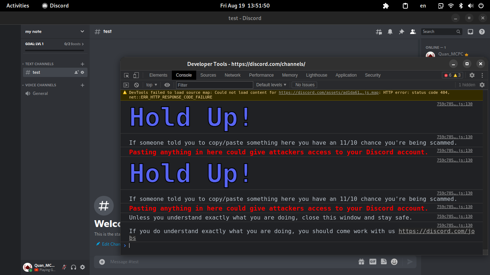
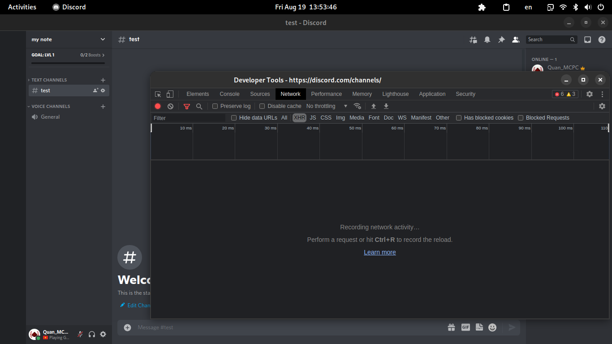
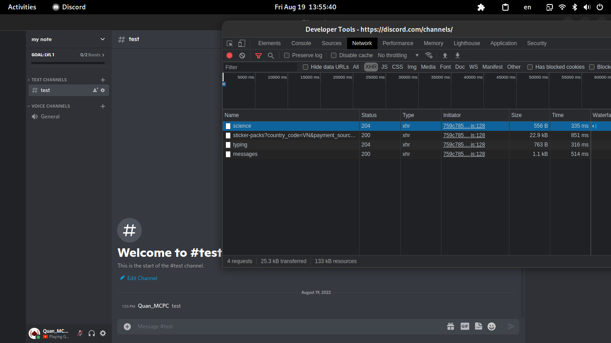
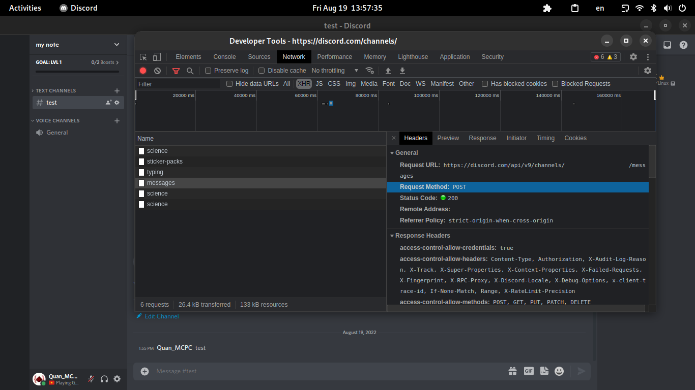
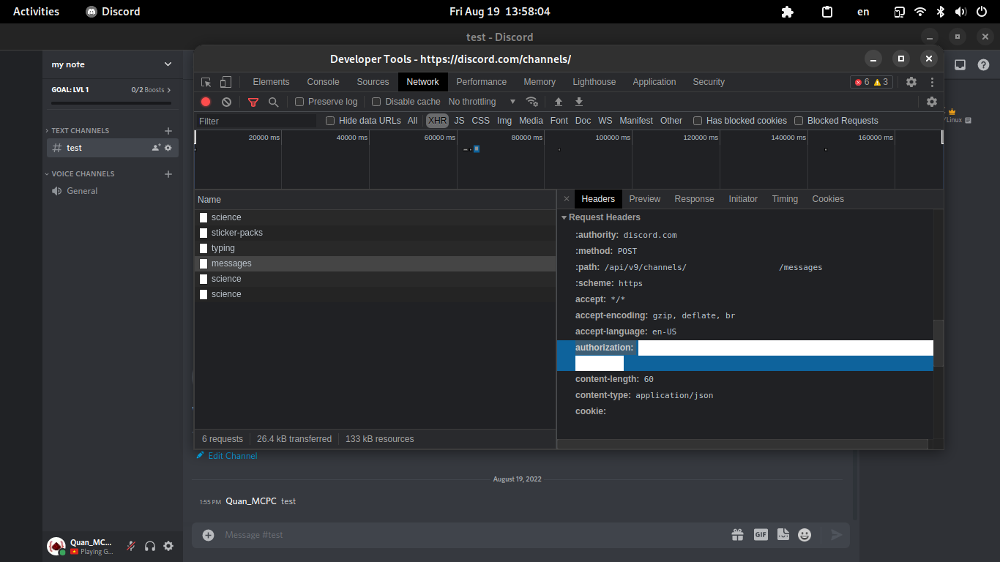
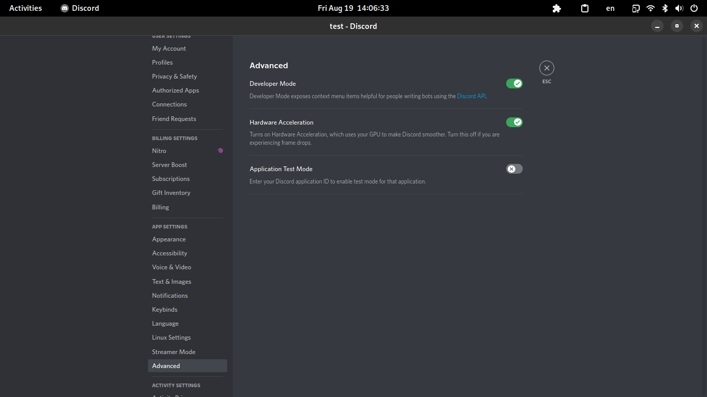
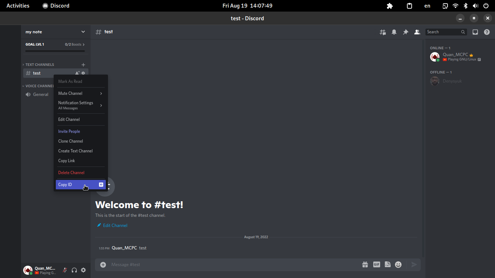

# Discord Message Scraper

A NodeJS program that allow you to scrape messages from channels in servers.

This project is the successor to my old project: [Get_Discord_MSG](https://github.com/sudoker0/Get_Discord_MSG)

## Notice
While the chances of your account getting disabled for using this program is small, we recommend you refer to the [Precautions](#precautions) section for information on how to keep yourself safe.

Also, this project is licensed under the MIT license, so you can do whatever you want with it, and we won't take any responsibility incase your account get banned.

## Precaution
 - Use an alt (Some server might not allow alt account so be sure to check your local server rules)
 - Increase the delay between requests: In the `config.ts` file, change the `DELAY` constant to a higher value like 500 or 1000
 - Don't run the program too many times or multiple at the same time

## Requirements
NodeJS v16.15.0 or higher (lower versions might work, but not tested)

## Installation
1. Install the dependencies:
```bash
npm install
```
2. Compile TypeScript files:
```bash
npm run compile
```

## Configuration
 - `src/config.ts`: This file contains the configuration for the NodeJS program.
   - `DELAY`: Delay between each requests
   - `ID`: List of channels in servers to scrape the messages from
   - `DATA_DIR`: Directory to put the scraped data (relative to the root of the program)
   - `RETRY_AMOUNT`: Amount of retries if the request to the API fail
   - ... and more can be found in the file.
 - `.env`: This file contains more sensitive information, like the Discord token.
   - `API_KEY`: The Discord token. (Refer to [How To Get](#how-to-get) to know how to get the Discord token)

## How To Run
Run the program:
```bash
npm run scrape
```

## How To Get
 - The Discord token:
   - In the Discord program, press `Ctrl` + `Shift` + `I` to open Developer Tools.
   
   - Go to the `Network` tab in the Developer Tools.
   
   - Type any message in any server (for this purpose, you should create a temporary server to do this) and press `Enter`.
   
   - Look at the `Network` tab, and find any request with the name `messages` or have the URL: `https://discord.com/api/v9/channels/xxxxxxxxxxx/messages`, and click on it.
   
   - Scroll down until you see the text `Authorization`, this is where Discord send the token. Copy the text after the `:` and paste it in the `API_KEY` constant in the `.env` file.
   

 - The ID of channels:
   - Enable the Developer Mode by going to User Settings -> Advanced and turn on Developer Mode.
   
   - Now switch to the server that you want to get the message, right click on the channel and select `Copy ID`.
   
   - Finally, add the ID into the `ID_LIST` constant in the `config.ts` file.

## Contribute
Open a pull request, create an Issue. It's that easy :)